# Duty Rotation Scheduler

A desktop application built in Python (web app version in progress) for automating the generation of monthly duty rotation schedules across multiple staff groups. The app handles scheduling constraints like unavailability, break-day quotas, and mid-month changes, and presents everything in a color-coded calendar interface.

## Background
This project grew out of a real operational need. Managing a monthly duty rotation for multiple staff members across different shifts, while accounting for PTO, unplanned absences, break days, and balanced duty assignment, was a tedious manual process. This tool was built to automate that process while keeping a human in the loop for overrides and edge cases.

## What It Does
The application generates weekday-only duty rotation schedules for a given month. Staff members are organized into shift groups (A, B, C), and each shift can have its own set of duties. The scheduler distributes assignments as evenly as possible across available staff while respecting:

 - Unavailability: planned PTO, unplanned absences, and miscellaneous unavailability are all tracked per staff member and excluded from scheduling
 - Break days: each shift group has a configurable number of break days per month per person; the algorithm spaces these out across the month and avoids stacking breaks on the same day where possible
 - Partial-month availability: if a staff member is added mid-month, their break-day quota is prorated based on remaining available weekdays
 - Past-day protection — when regenerating a schedule mid-month, all past days and any manually protected days are preserved; only future unassigned days are touched

#### Workspaces
The app supports multiple independent workspaces, each with its own staff roster, duty definitions, break-day settings, and schedule history. This makes it suitable for managing scheduling for separate teams or departments from a single installation.

---

## Features

#### Calendar View
The main interface displays a full monthly calendar with configurable color-coded assignment blocks for each staff member. Shift groups are displayed separately within each day cell. Break and "off" days are shown inline as labeled indicators. Icons appear on days that are individually locked (distinct from month-level lock) and/or have notes attached to them. Navigation arrows allow browsing forward and backward through months.

#### Desktop
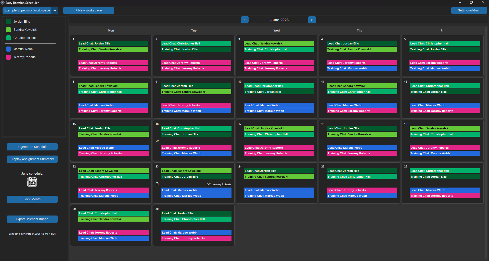

#### Web app
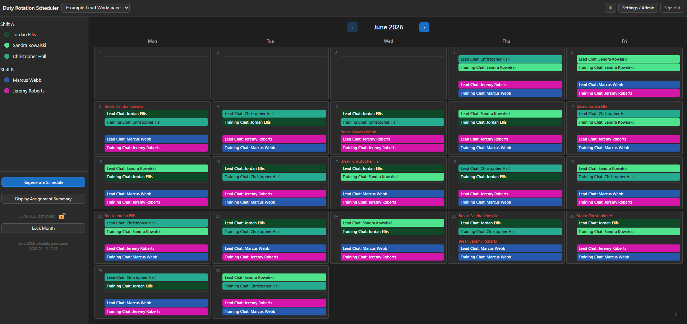

---

#### Manual Day Editing
Clicking any calendar day opens a day editor where assignments can be changed, break days can be reassigned, and off days can be added or removed per shift. The editor enforces break-day limits and warns before allowing overrides that would exceed a staff member's configured quota. The editor also allows attaching a free-text note to a day and toggling per-day protection, which locks that day's assignments even if that month's schedule is regenerated for any reason.

#### Desktop
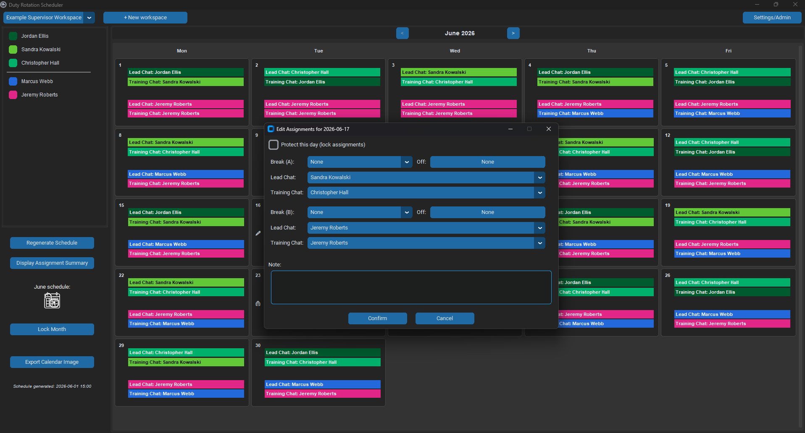

#### Web app
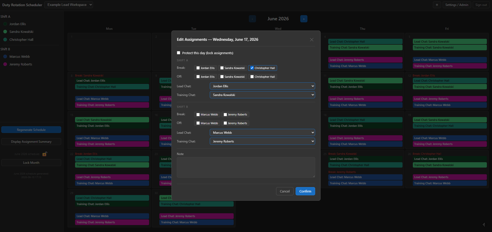

---

#### Assignment Summary
A summary window lists each staff member's duty assignment counts, break days (with dates), and unavailable days for the current month, useful for auditing fairness and confirming the schedule makes sense before publishing.

#### Desktop
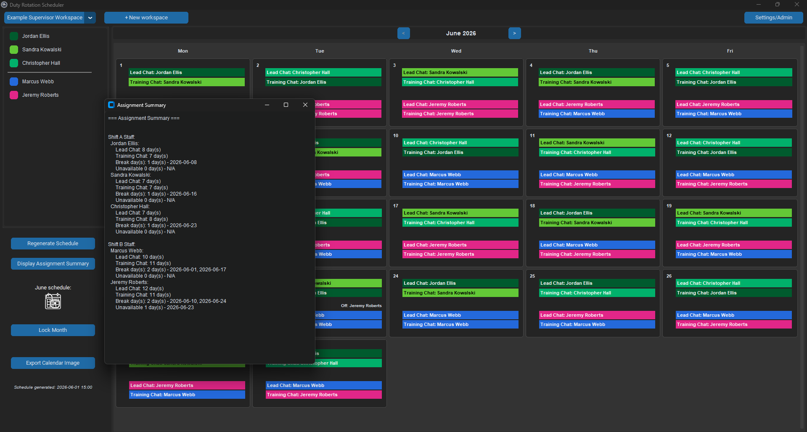

#### Web app
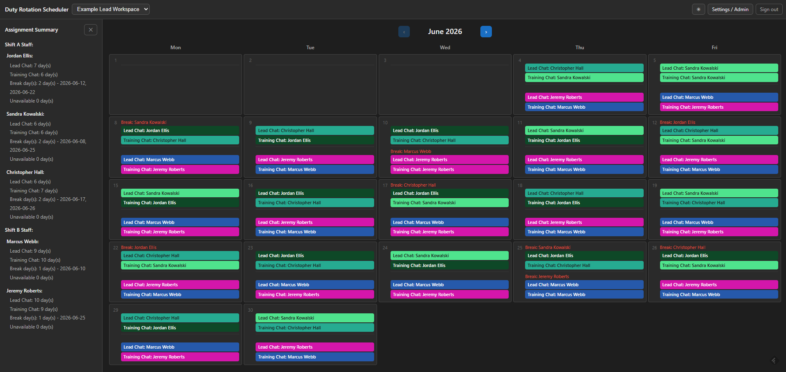

---

#### Settings / Admin Panel
A dedicated admin view provides tabs for managing staff and duties, workspace settings, and viewing the audit log.

 - Members tab - add, edit, or remove staff; set shift group, add/remove unavailable dates
   
   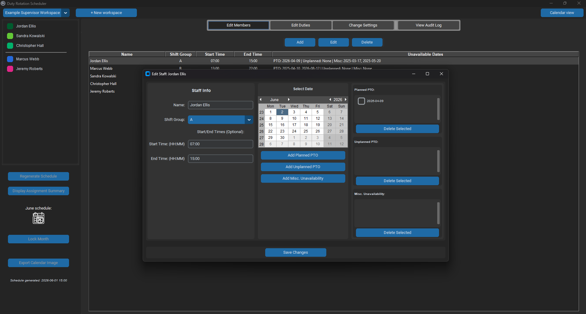 &nbsp;&nbsp;&nbsp;&nbsp; 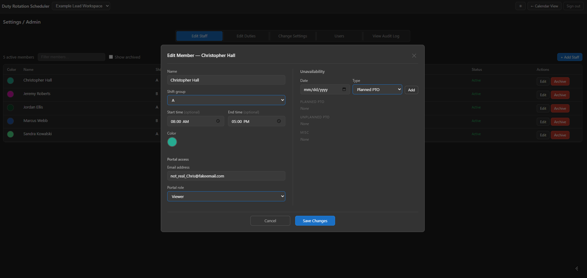

 - Duties tab - define duty types, assign them to shift groups, and 'delete' (archive) duties that are no longer active
   
   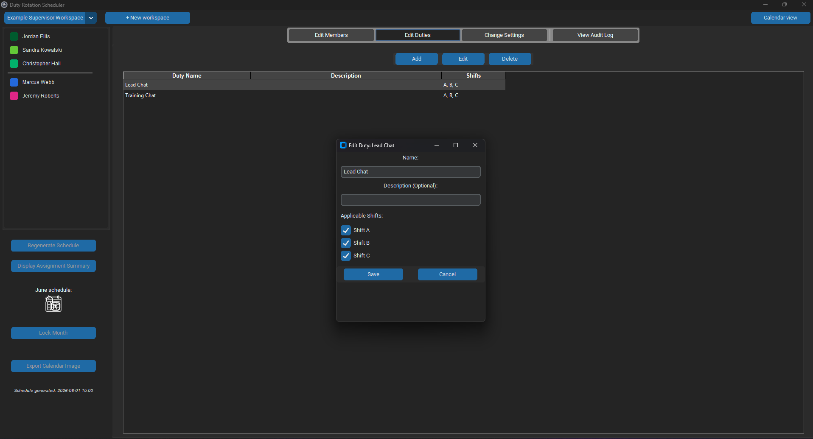 &nbsp;&nbsp;&nbsp;&nbsp; 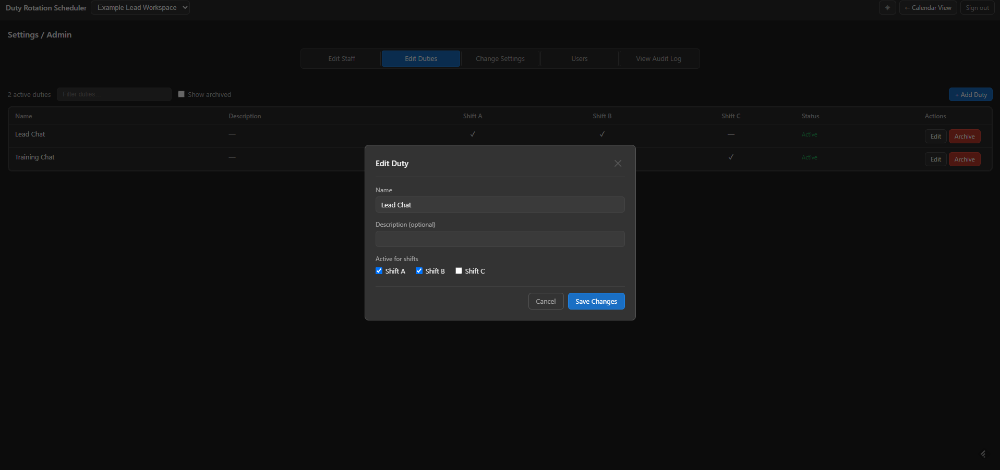

 - Settings tab - configure break-day quotas per shift group, rename or delete workspaces, and view/restore archived schedules

   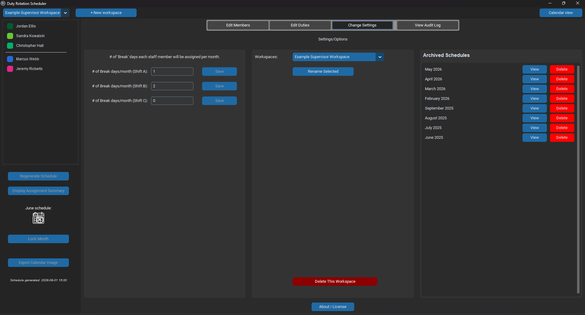 &nbsp;&nbsp;&nbsp;&nbsp; 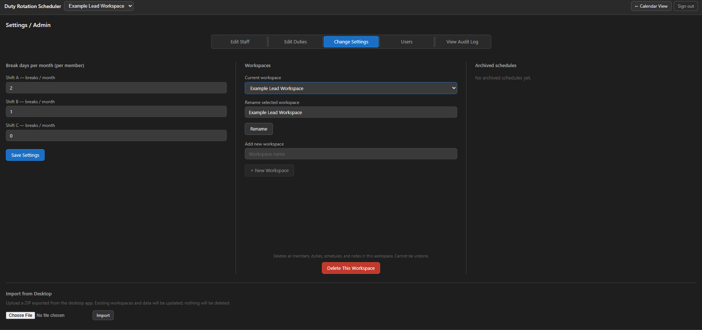
   
 - Audit log tab - view a timestamped history of changes made in the workspace: staff edits, duty changes, workspace renames, and schedule events. The log is filterable by keyword and sortable by any column.

   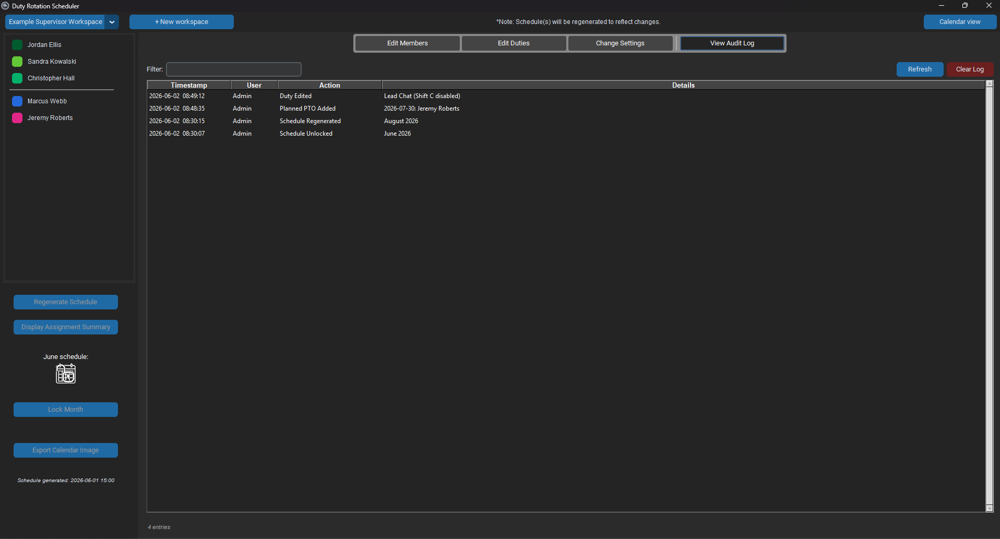 &nbsp;&nbsp;&nbsp;&nbsp; 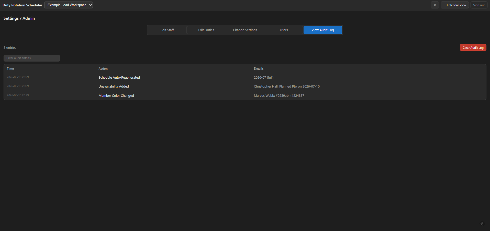

---

**Schedule Locking:** Once a schedule is finalized, it can be locked to prevent accidental regeneration. The lock state is displayed on the calendar and disables the regenerate button.

**Export to Image:** The current month's calendar can be exported as a PNG file, useful for sharing with staff or posting in a shared location.

**Schedule Archiving:** When a month rolls over, previous schedules are automatically moved to an archive. Archived schedules can be viewed or deleted from the Settings panel.

---

### How the Scheduler Works
The scheduling algorithm runs in two phases.

**Phase 1: Break day assignment.** For each shift group, the algorithm assigns each staff
member a configured number of break days drawn from future available weekdays. Rather than
simply segmenting the month linearly, it works at the week level - it selects target weeks
for each member's breaks, then picks a specific day within each target week. The week
selection logic staggers breaks across staff; when a shift has one break per person per
month, members are distributed evenly across the full span of available weeks. For multiple
breaks, each additional break is spaced apart from the member's existing ones.
The algorithm also avoids placing breaks on days adjacent to the member's other breaks,
on days when other staff in the same shift are already unavailable, and on days where
putting someone on break would leave too few staff to cover the shift's duties. Break-day
quotas for staff who join mid-month are prorated based on remaining available weekdays.

**Phase 2: Duty assignment.** For each remaining weekday, the algorithm assigns staff
to duties by shift group. For each duty, it selects the available staff member with the
lowest assignment *rate* for that duty (assignments relative to their assignable days),
using total assignment rate across all duties as a tiebreaker. It also avoids assigning
the same person to consecutive days where possible. After the initial pass, a
post-processing step corrects any residual imbalances - both per-duty and overall - by
swapping assignments on future unprotected days until counts are within one of the
per-member target.

When regenerating mid-month, all past assignments and past break days are preserved. Only
future unprotected days are recalculated, and the history of past assignments is carried
forward so the remaining days balance correctly against what has already occurred.

---

### Tech Stack

 - Python with CustomTkinter for the GUI
 - JSON for persistent local storage of schedules, staff, duties, and settings
 - Pillow for calendar image export
 - Data is stored in a user-specific AppData directory when packaged as an executable

---

### Skills Demonstrated

 - Designing and implementing a non-trivial scheduling algorithm with multiple interacting constraints
 - Building a full desktop GUI application with custom widgets, modal dialogs, and dynamic layout updates
 - Managing persistent state across sessions with a JSON-based data layer including migration from legacy storage paths
 - Supporting multiple independent data contexts (workspaces) within a single application
 - Handling edge cases gracefully — mid-month regeneration, prorated quotas, archived duty types, and manual overrides
 - Implementing an audit trail with per-workspace persistence, filterable/sortable UI, and automatic logging of state changes across multiple editor elements
